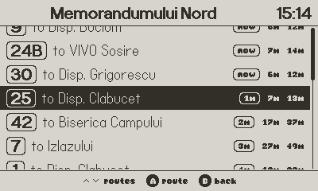
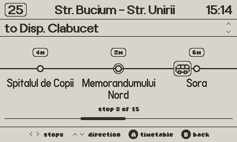
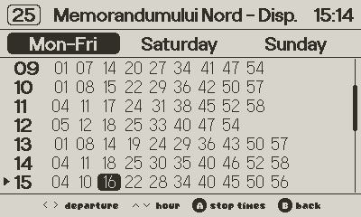

# ConexiuniCluj for Playdate

Cluj-Napoca bus and tram routes, stops, and timetables, on Panic's
[Playdate](https://play.date) handheld. It's a pocket-sized port of
[conexiuni-cluj](https://bus.bmarian.online): pull up a stop, see what's
coming and when, check the full CTP timetable, all without a phone.

The app syncs once over Wi-Fi, then works entirely offline. Check a
timetable underground, on a plane, wherever.

<table>
<tr>
<td align="center" width="33%">

<br><sub>See every route serving a stop, and when the next bus shows up</sub>
</td>
<td align="center" width="33%">

<br><sub>Watch the bus travel the route, stop by stop</sub>
</td>
<td align="center" width="33%">

<br><sub>Full weekday / Saturday / Sunday timetables</sub>
</td>
</tr>
</table>

## What it does

- **Browse** every route and stop in Cluj-Napoca.
- **Favorite** a route and a stop for one-tap access from the main menu.
- **Route view**: an animated bus drives along the route, direction-aware.
- **Stop view**: every route through that stop and its live-ish countdown.
- **Timetables**: the real CTP schedule, with explicit times or frequency
  windows where that's how a route runs.

## Running it

You'll need the [Playdate SDK](https://play.date/dev/) with
`PLAYDATE_SDK_PATH` set and `%PLAYDATE_SDK_PATH%/bin` on `PATH`.

```bash
git clone https://github.com/bmarian/conexiuni-cluj-playdate
cd conexiuni-cluj-playdate
git submodule update --init
pdc source ConexiuniCluj.pdx
PlaydateSimulator ConexiuniCluj.pdx
```

The app talks to the live API, so there's no local backend to run.
